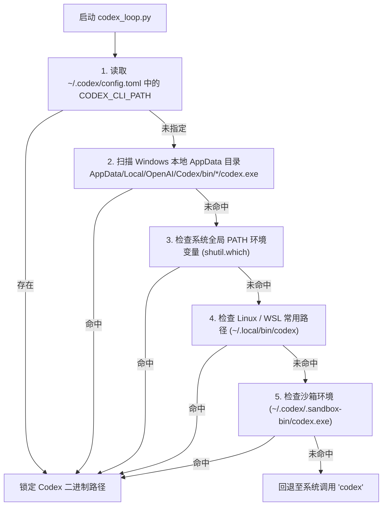

# Codex CLI 运行环境与模型动态追踪机制 (Environment & Model Resolution)

本文档系统梳理了 `codex-loop` 在跨平台环境（Windows / Linux）下的 Codex CLI 二进制探测逻辑、CC-Switch 账户对接与零硬编码模型自动追踪机制。

---

## 1. 跨平台 Codex CLI 探测机制

在不同操作系统与配置方式下，OpenAI Codex CLI 的安装路径可能存在差异。为了保证脚本开箱即用，`scripts/codex_loop.py` 实现了多级自动寻径探测（优先级由高到低）：



### 本地环境实测探测结果 (Windows)
- **实际定位路径**：`C:\Users\Nauki\AppData\Local\OpenAI\Codex\bin\ca9abb0b4d8ac692\codex.exe`
- **版本**：`codex-cli 0.159.0`
- **备用沙箱路径**：`C:\Users\Nauki\.codex\.sandbox-bin\codex.exe`（版本 `0.154.0`）

---

## 2. 账号与模型管理体系 (CC-Switch & config.toml)

Codex CLI 的身份鉴权和模型调度遵循**无缝解耦原则**：

1. **CC-Switch 自动切换**：
   - CC-Switch 会自动将当前激活的 OpenAI 账号凭据与提供方信息写入 `~/.codex/auth.json` 与 `~/.codex/config.toml`。
   - `codex_loop.py` 执行时不干预鉴权，直接读取激活凭证。
2. **当前生效模型**：
   - 模型名称：**`gpt-6.1-sol`**
   - 推理强度（Reasoning Effort）：**`xhigh`**（极限深度链式思考）
   - 鉴权模式：`auth_mode = "chatgpt"`

---

## 3. 核心设计原则：零硬编码与自动追踪 (Zero-Hardcode Principle)

用户在对话中重点关切：**“当 OpenAI 发布新模型或 Codex 切换默认模型时，系统能否自动跟进，而无需手动改脚本？”**

`codex-loop` 严格遵循了**零硬编码原则**：

| 调用阶段 | 是否显式传递 `-c model="..."` | 行为表现 |
| :--- | :--- | :--- |
| **未指定模型（默认）** | **否**（完全由环境驱动） | Codex CLI 自动读取 `~/.codex/config.toml`，自动继承当前最新模型（如 `gpt-6.1-sol`），完全与上游同步。 |
| **显式指定模型** | **是**（如 `--model gpt-5` 或 `--model o3`） | 覆盖默认设置，强制使用指定模型进行定向实验或轻量级审查。 |
| **推理深度 (Reasoning)** | 继承配置 / 默认 `xhigh` | 确保架构规划与代码审查充分调动强推理模型的 Chain-of-Thought 能力。 |

---

## 4. 常用环境调试命令

在项目根目录下，可通过以下命令随时检查当前运行环境的状态：

```bash
# 查看当前检测到的二进制路径、激活模型、推理级别与鉴权模式
python scripts/codex_loop.py info
```

典型输出：
```json
{
  "binary_path": "C:\\Users\\Nauki\\AppData\\Local\\OpenAI\\Codex\\bin\\ca9abb0b4d8ac692\\codex.exe",
  "binary_exists": true,
  "active_model": "gpt-6.1-sol",
  "reasoning_effort": "xhigh",
  "auth_mode": "chatgpt",
  "config_exists": true,
  "account_id": ""
}
```
