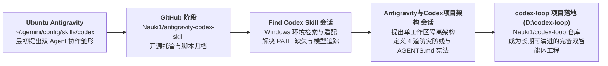

# 技能溯源、演进历史与双向同步指南 (Skill Origin & Evolution)

本文档记录了 `codex-loop` 技能的诞生背景、跨平台迁移历程以及与 Antigravity 全局技能的维护同步方式。

---

## 1. 技能演进脉络 (Evolution Timeline)



### 第一阶段：Ubuntu 原生探索
用户最初在 Ubuntu 系统的 Antigravity 环境下创建了 `codex` 技能，通过 Shell 包装调用 `~/.local/bin/codex`，实现了与 OpenAI Codex 的初步对接，并将源码推送到 GitHub：[Nauki1/antigravity-codex-skill](https://github.com/Nauki1/antigravity-codex-skill)。

### 第二阶段：Windows 跨平台迁移与发现（"Find Codex Skill"）
- 用户切换到 Windows 机器后，希望重新调出之前制作的技能。
- 检索发现 Windows 端与 Ubuntu 文件系统相互隔离，未预置该技能。
- Antigravity 协助从 GitHub 拉取仓库，安装至 Windows 全局路径：`C:\Users\Nauki\.gemini\config\skills\codex`。
- 针对 Windows 上 Codex 二进制无全局环境变量的问题，重构了 `codex_loop.py` 的多重探测逻辑，成功对接 `AppData\Local\OpenAI\Codex\bin\ca9abb0b4d8ac692\codex.exe`（版本 `0.159.0`）。
- 厘清了 CC-Switch、`~/.codex/config.toml` 与最新模型 `gpt-6.1-sol`（`xhigh` 推理模式）的自动追踪机制。

### 第三阶段：单工作区双 Agent 范式突破（"Antigravity与Codex项目..."）
- 用户深入思考：如何把对话、项目文件与 Codex/Antigravity 融为一体？
- 确立了**“单一工作区、目录隔离、Git 为唯一事实标准、`AGENTS.md` 为共同契约”**的体系。
- 解决了**“单独使用 Gemini 是否割裂”**与**“AI 过度自信/自检盲区搞崩项目”**两大顾虑，确立了四道物理防线。
- 决定以独立代码库 `D:\codex-loop`（关联 GitHub [Nauki1/codex-loop](https://github.com/Nauki1/codex-loop)）作为长青演进项目。

---

## 2. 项目工作区与全局 Skill 的双向同步 (Sync Guide)

`D:\codex-loop` 本身既是一个完整的双智能体协同项目，也是标准的 Antigravity 技能库。

### 全局安装与生效路径
Antigravity 全局技能读取目录：
```text
C:\Users\Nauki\.gemini\config\skills\codex\
```

### 一键同步至全局
当你在 `D:\codex-loop` 迭代了脚本、文档或规范后，运行以下 PowerShell 命令即可将改动一键同步到全局技能目录：

```powershell
# 仅同步技能运行必需文件（安全排除 .git 与 .agents，严格保护目标克隆仓库的 Git 配置）
Get-ChildItem -Path "D:\codex-loop" -Exclude ".git", ".agents" | Copy-Item -Destination "$env:USERPROFILE\.gemini\config\skills\codex" -Recurse -Force
```

同步完成后，在任何工程或新建的 Antigravity 窗口中，只需输入 `/codex`，即可立即享受最新的架构规划与代码审查能力。
